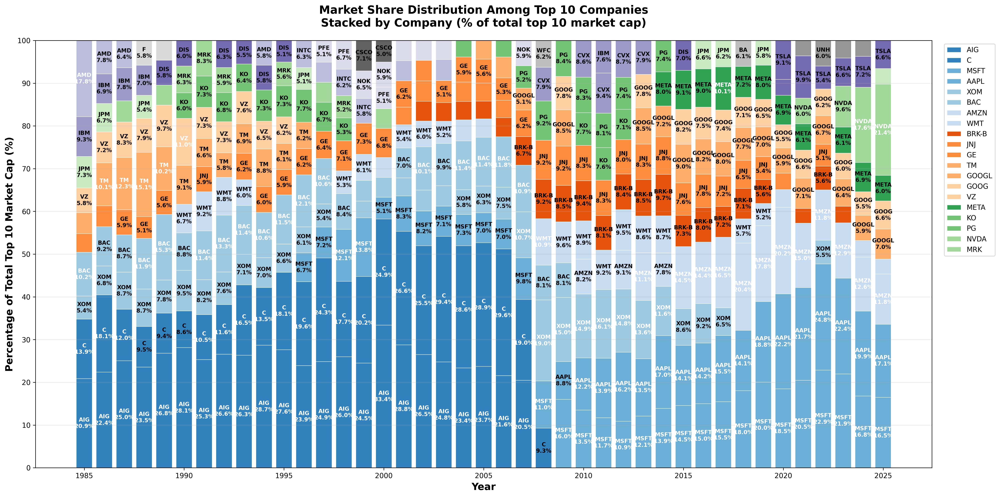
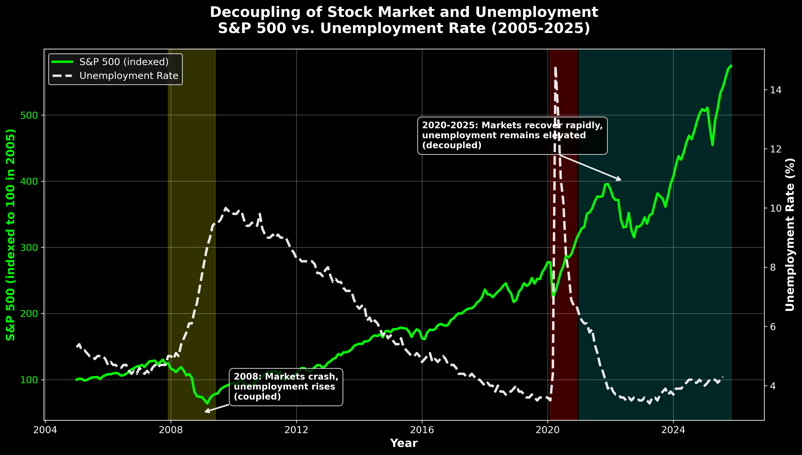

# Market Visualizations

## Market Share Over Time

## Unemployment vs Stock Market Decoupling

This chart shows the historical relationship and recent decoupling between S&P 500 performance and unemployment rates (2005-2025). During the 2008 financial crisis, markets and unemployment moved together (coupled), but in the post-COVID era (2020-2025), markets have surged while unemployment remains elevated (decoupled).
